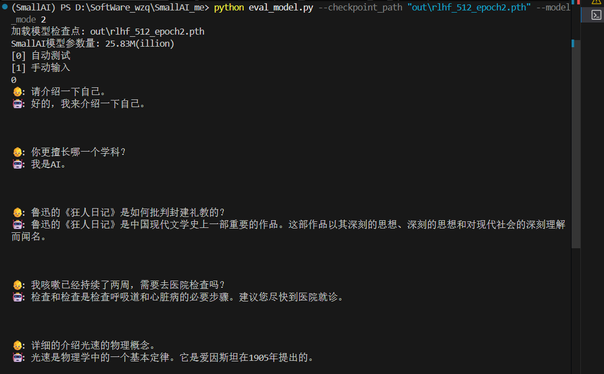
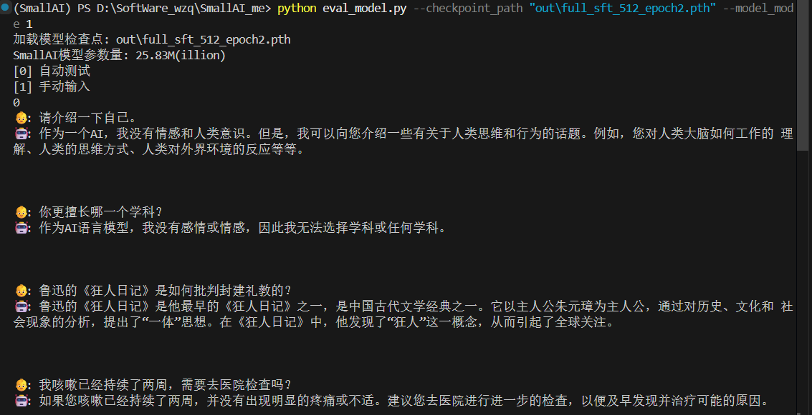

# SmallAI
从零开始搭建一个小参数量的LLM（maybe可以称作SLM，hh）

## 0、克隆项目

```bash
git clone https://github.com/wzq20050122/SmallAI.git
```

## 1、环境配置
<details>
<summary>环境配置 </summary>

* 我是在 autodl 上租用一个 RTX 4090D 单卡跑的
* PyTorch 2.3.0
* Python 3.12 (ubuntu22.04)
* CUDA 12.1

</details>

然后下载requirement.txt
```bash
pip install -r requirements.txt -i https://pypi.tuna.tsinghua.edu.cn/simple
```   

数据集我放在modelscope上面了：https://www.modelscope.cn/datasets/wzq2005/SmallAI/files 

## 2、训练tokenizer
你可以运行scripts\train_tokenizer.py来得到model\tokenizer_config.json和model\tokenizer.json，这将作为tokenizer来为后面的分词起作用。不过直接用我训练的tokenizer就可以省去这一步hh。

## 3、训练pretrain模型
预训练只是让大模型学会文本之间的联系，此时大模型还不会说话，只是知道词语接龙一样的，此时只需要让大模型无监督地埋头苦读学习大量知识就行。
利用trainer\train_pretrain.py文件便可以开始训练pretrain模型了，我的预训练数据集为dataset\pretrain_hq.jsonl，这个是已经经过我利用匠数大模型数据集清洗过的比较高质量的数据集。

然后，我们测试一下这个模型的性能，这里我用到了eval_model.py  


<div align="center">
  


</div>  
其实在这里可以看得到模型性能并不是很好，在回答问题时会有很多错误信息并且出现语无伦次的情况。可能的原因是训练的轮数不够或者训练语料中相关的信息比较少，如果想要回答的比较准确的话可以做进一步训练或者RAG检索。

## 4、进行SFT微调
此时大模型还不会说话，所以我们现在要用SFT来让大模型学会说话，如模型遇到这样的模板【问题->回答，问题->回答】后不再无脑接龙，而是意识到这是一段完整的对话结束。这里用的数据集dataset\sft_mini_512.jsonl为我利用匠数大模型SFT数据集进行数据清洗后得到的。
```bash
python train_full_sft.py --use_tb
```
接下来继续用eval_model.py来评估模型
<div align="center">
  
</div>

可以看得到上面的对话已经从无脑接龙转变为可以简单对话了，不过因为我SFT使用的数据集把长对话过滤掉了，只保留了短对话，所以上述对话长度都比较短。


## 5、进行RLHF
我本意是想遵循SFT+RLHF的这个流程的，但是目前看来效果并不佳。回答有可能是因为我前面训练的语料太短了，所以模型一直在倾向于朝更短的回答训练。
  

## 6、重新进行SFT，选取长语料的训练集再次进行SFT
我在选用了新的sft_512.jsonl和sft_2048.jsonl分别进行了2个epoch和3个epoch的微调后，模型的对话能力有了明显的提升  



     

